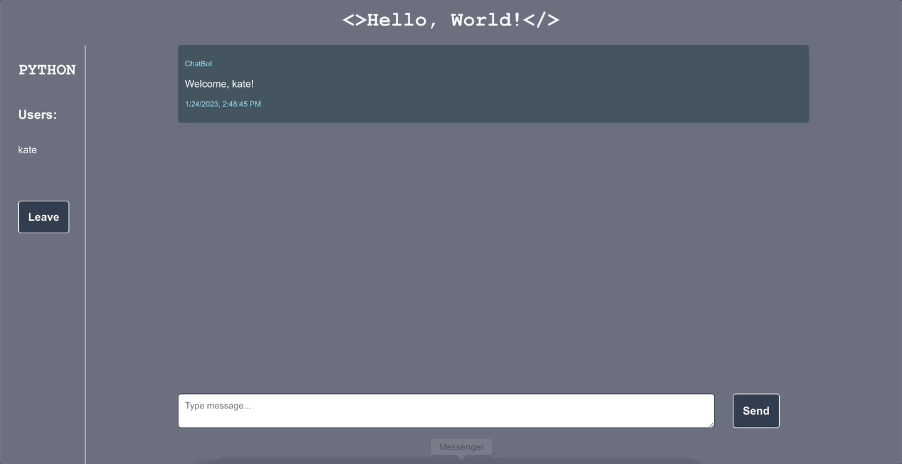

# Hello, World

## Overview
**Hello, World** is an in-progress application that allows for a user to enter a chatroom and chat with other developers. Chatroom themes are based off of different programming languages. Users can come and go from each chatroom as they please. The partner back-end repo can be found [here](https://github.com/kpn678/hello-world-be).

#### Goals
- Experiment with building a solo fullstack application while navigating my own inexperience with back-end
- Demonstrate competence with front-end technologies including React (and relevant hooks), Router, asynchronous JavaScript
- Gain experience with back-end technologies including Node.js and Express
- Learn about databases through HarperDB and enabling real-time, bidirectional communcation between the client and server using Socket.io

## Deployed Links
- [Website Link](https://hello-world-chat-app.vercel.app/)(link will load, but its functionality is hindered due to back-end not being deployed yet)
- Back-end Link will be deployed soon

## Set Up
1. Fork this [repository](https://github.com/kpn678/hello-world-fe), and clone it into your local machine.
2. Navigate into the repository and run `npm install` from your command line.
3. To view the app running inside the local host, run `npm start`.
4. For back-end set up, please go [here](https://github.com/kpn678/hello-world-be). Back-end must be running in order to use the front-end.

## Visual Walkthrough
- User can choose a username and chatroom on the login page

- User can type a message and view messages from other users

- User can leave the chatroom and join a new one

## Technologies Implemented
- Javascript
- HTML
- CSS
- React
- React Router
- Node.js
- Express
- Socket.io
- HarperDB

## Current Progress & Future Directions
The current, major obstacle is figuring out how to deploy the back-end and not having to rely on locally starting the back-end repository in order to use the app. Research into better understanding HarperDB, as well as reserching deployment hosting sites, e.g. Railway, Heroku, etc., is underway.

As for the front-end, while the app has been deployed, its full usage is dependent on the back-end being deployed. Outside of this, next steps include improving error handling and mobile responsiveness. The app is also simple in scope at this time, but once remaining bugs/issues are managed, there are plans to research features such as local storage.

## Contributor
- [Kristy Nguyen](https://www.linkedin.com/in/kristypnguyen/)
